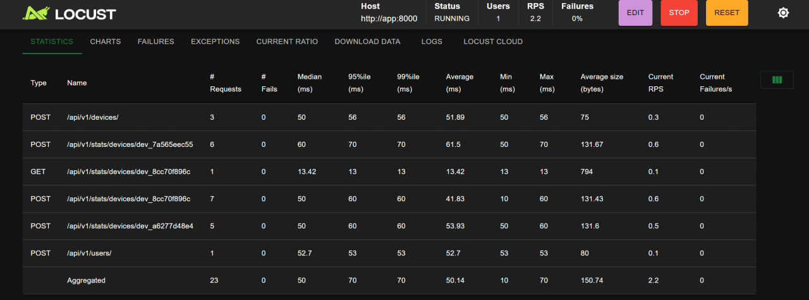

# Device Statistics Service

A FastAPI-based service for collecting, storing, and analyzing statistics from devices.

## Features

- Device registration and management
- User management with device associations
- Collection of device statistics (x, y, z coordinates)
- Statistical analysis of device data:
  - Minimum value
  - Maximum value
  - Count
  - Sum
  - Median
- Time-based filtering for data analysis
- User-based aggregation of statistics across multiple devices
- Containerized deployment with Docker Compose
- Load testing with Locust

## System Architecture

- **FastAPI**: High-performance web framework for building APIs
- **PostgreSQL**: Relational database for storing device data and statistics
- **SQLAlchemy**: ORM for database operations
- **Docker & Docker Compose**: Containerization for easy deployment
- **Locust**: Load testing tool for performance evaluation

## Prerequisites

- Docker and Docker Compose

## Development

### Project Structure

```
device-stats-service/
│
├── app/                  # Application code
│   ├── models/           # Database models
│   ├── schemas/          # Pydantic schemas
│   ├── routers/          # API endpoints
│   └── services/         # Business logic
├── locust/               # Load testing configuration
└── alembic/              # Database migrations
```


## Getting Started

1. Clone the repository:

```bash
git clone https://github.com/yar0slave/statictics_service/
cd statictics_service
```

2. Start the services using Docker Compose:

```bash
docker-compose up -d
```

This will start:
- The FastAPI application on port 8000
- The PostgreSQL database on port 5432
- The Locust load testing interface on port 8089

3. Access the API documentation at http://localhost:8000/docs

## API Endpoints

### Users

- `GET /api/v1/users/` - List all users
- `POST /api/v1/users/` - Create a new user
- `GET /api/v1/users/{user_id}` - Get user details with associated devices
- `PUT /api/v1/users/{user_id}` - Update user details
- `DELETE /api/v1/users/{user_id}` - Delete a user

### Devices

- `GET /api/v1/devices/` - List all devices
- `POST /api/v1/devices/` - Register a new device
- `GET /api/v1/devices/{device_id}` - Get device details
- `PUT /api/v1/devices/{device_id}` - Update device details
- `DELETE /api/v1/devices/{device_id}` - Delete a device

### Statistics

- `POST /api/v1/stats/devices/{device_id}` - Submit statistics for a device
- `GET /api/v1/stats/devices/{device_id}` - Get statistics for a device
- `POST /api/v1/stats/devices/{device_id}/analyze` - Analyze statistics for a device
- `POST /api/v1/stats/users/{user_id}/analyze` - Analyze statistics for all devices of a user


## Load Testing

The service includes a Locust configuration for load testing. Access the Locust web interface at http://localhost:8089 to configure and run load tests.





